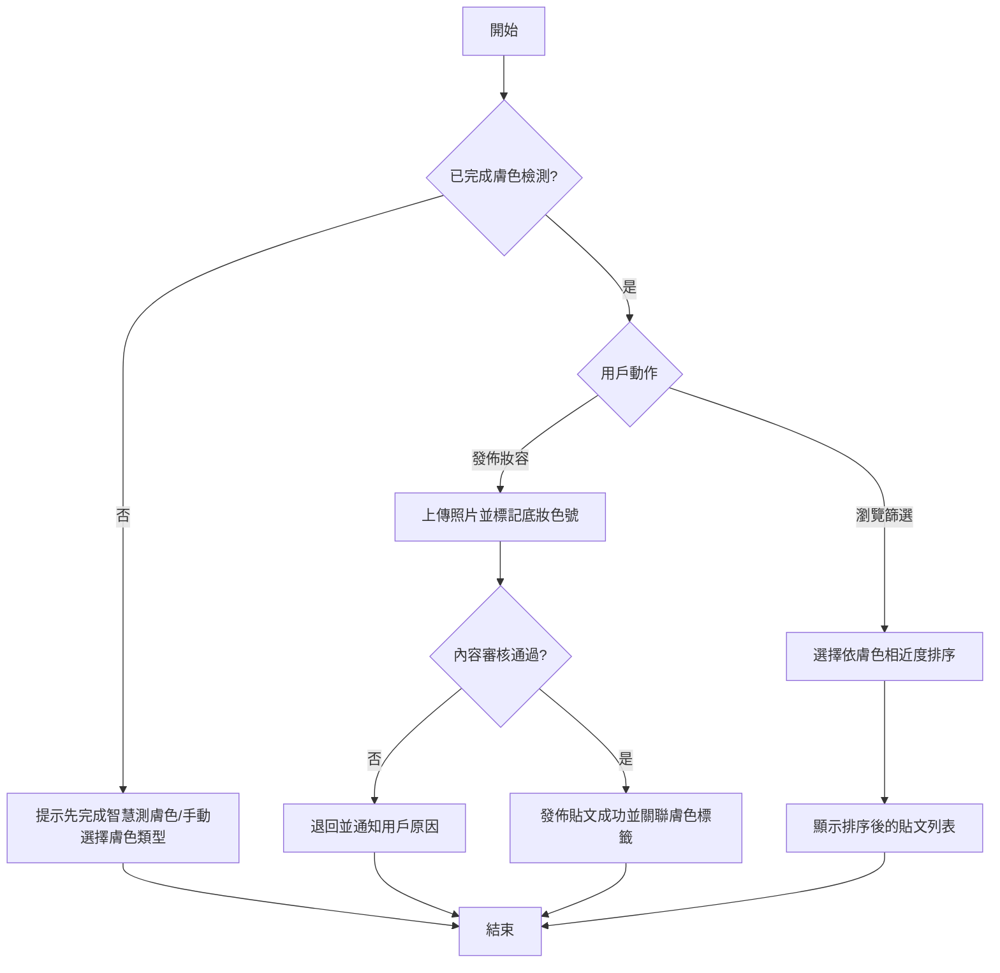

# User Story: 彩妝社群妝容分享與膚色相近度篩選

**As a** 已使用底妝產品的彩妝社群小程序用戶
**I want to** 發佈自己的妝容照並標記使用的底妝色號,同時能依膚色相近度篩選瀏覽其他用戶的妝容
**So that** 我能找到膚色相近者的妝容作為選色與上妝參考,提升選購與化妝的信心 ⚠️〔信心:中〕- 此價值陳述為推測,建議與業務方確認實際目標(如導購轉換 vs 社群活躍度)

## 驗收標準 (Acceptance Criteria)

### 正常流程

- **Given** 用戶已登入社群小程序,且已完成個人膚色檢測(假設沿用「智慧測膚色」功能的分析結果)⚠️〔信心:低〕- 跨功能資料互通為假設,需與資料團隊確認
  **When** 用戶上傳妝容照並標記使用的底妝品牌與色號
  **Then** 系統成功發佈貼文,並將貼文與用戶的膚色標籤關聯儲存

- **Given** 瀏覽者已完成膚色檢測,或已於個人設定手動選擇膚色類型
  **When** 瀏覽者開啟篩選功能並選擇「依我的膚色相近度」排序
  **Then** 系統依膚色相近度由高至低顯示妝容貼文列表

### 異常流程

- **Given** 瀏覽者尚未完成膚色檢測且未手動選擇膚色類型
  **When** 瀏覽者嘗試使用「依膚色相近度篩選」功能
  **Then** 系統提示「請先完成智慧測膚色或手動選擇膚色類型」,並提供快速入口

- **Given** 上傳的妝容照未偵測到人臉,或內容違反社群規範(如包含不當內容)
  **When** 系統執行發佈前的內容審核
  **Then** 貼文被退回或轉入人工審核,並通知用戶具體原因

## 邊界情境 (Edge Cases)

1. 用戶標記的底妝色號不存在於商品資料庫,或拼寫/選項有誤
2. 不同品牌底妝色號命名與色階系統不一致,系統如何統一比對「相近膚色」的標準 ⚠️〔信心:低〕- 需與商品資料團隊確認跨品牌色號對應機制
3. 用戶膚色隨季節變化(如夏季曬黑),導致篩選依據的膚色資料過時,可能需定期提示重新檢測
4. 內容審核的判定門檻與人工介入流程 ⚠️〔信心:低〕- 需與信任與安全(Trust & Safety)團隊確認規範細節

## 流程圖

## ✏️ 待專業補充

請團隊補充以下資訊:
- [ ] **技術約束**:跨小程序/功能間膚色資料的儲存與存取權限設計、內容審核系統(人工/機器)的效能與 SLA
- [ ] **優先順序確認**:社群功能與核心導購功能(如試色、購買)的資源投入優先度
- [ ] **真實用戶驗證**:用戶是否願意公開自己的膚色標籤與妝容照,是否有隱私疑慮
- [ ] **安全性考量**:妝容照涉及真人臉部影像,需確認資料保存期限、去識別化與相關法規遵循(如個人信息保護法)
