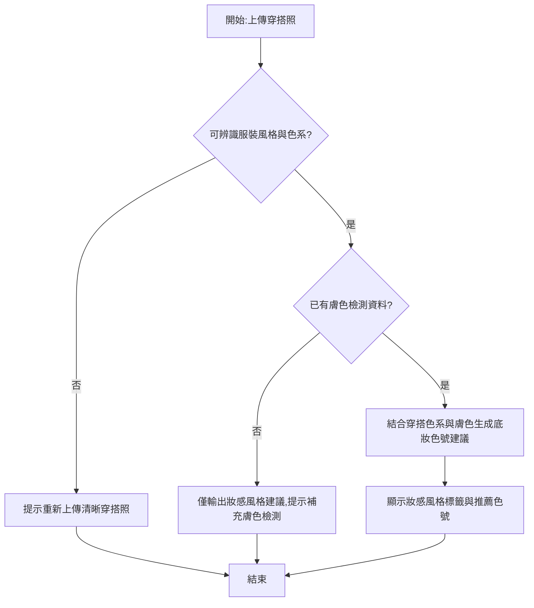

# User Story: 穿搭照推薦底妝色調與妝感風格

**As a** 想讓穿搭與妝容風格協調一致的小程序用戶
**I want to** 上傳當日穿搭照,取得系統推薦的底妝色調與妝感風格建議
**So that** 我能減少自行摸索穿搭與妝容搭配的時間,讓整體造型更協調一致 ⚠️〔信心:中〕- 此價值陳述為推測,建議與業務方確認是否以「造型協調度」或「延伸購買底妝/服飾商品」為主要目標

## 驗收標準 (Acceptance Criteria)

### 正常流程

- **Given** 用戶已上傳穿搭照,且系統可辨識主要色系與風格(如簡約、甜美、率性)
  **When** 上傳完成
  **Then** 系統於 5 秒內輸出推薦的底妝色調(如自然裸色調、偽素顏、霧面持久)與妝感風格標籤

- **Given** 用戶已擁有膚色檢測資料(假設沿用「智慧測膚色」功能結果)⚠️〔信心:低〕- 跨功能資料依賴為假設,需確認資料互通機制
  **When** 系統生成底妝推薦
  **Then** 推薦結果同時考慮穿搭色系與用戶膚色,輸出符合兩者的具體色號建議

### 異常流程

- **Given** 上傳的穿搭照過暗、遮蔽過多,或無法辨識服裝主體
  **When** 系統嘗試分析穿搭色系與風格
  **Then** 系統提示「無法辨識穿搭風格,請重新上傳清晰的全身照或半身照」

- **Given** 用戶尚未完成膚色檢測
  **When** 系統嘗試生成底妝推薦
  **Then** 系統僅輸出妝感風格建議(不含具體色號),並提示補充膚色檢測以取得精準色號推薦

## 邊界情境 (Edge Cases)

1. 穿搭包含多種風格混搭(如西裝外套+運動鞋),系統如何判定主導風格
2. 季節性穿搭(如厚重冬裝 vs 清涼夏裝)可能影響妝感濃淡建議,需納入判斷邏輯
3. 系統誤判穿搭風格標籤時,是否允許用戶手動調整或否決,避免錯誤推薦 ⚠️〔信心:低〕- 屬產品互動設計問題,需與設計團隊確認
4. 穿搭照包含多人合照時,系統如何定位實際分析對象 ⚠️〔信心:低〕- 需與演算法團隊確認影像辨識策略

## 流程圖

## ✏️ 待專業補充

請團隊補充以下資訊:
- [ ] **技術約束**:服裝風格/色系辨識模型的準確度要求、與膚色資料跨功能串接的技術方案
- [ ] **優先順序確認**:此功能是否列入近期 Roadmap,以及與「智慧測膚色」等既有功能的資料共用規劃
- [ ] **真實用戶驗證**:用戶對「穿搭風格標籤」推薦結果的接受度,是否需要人工標註輔助訓練模型
- [ ] **安全性考量**:穿搭照片的儲存期限與用途範圍,是否僅用於單次推薦或會被用於長期風格畫像
