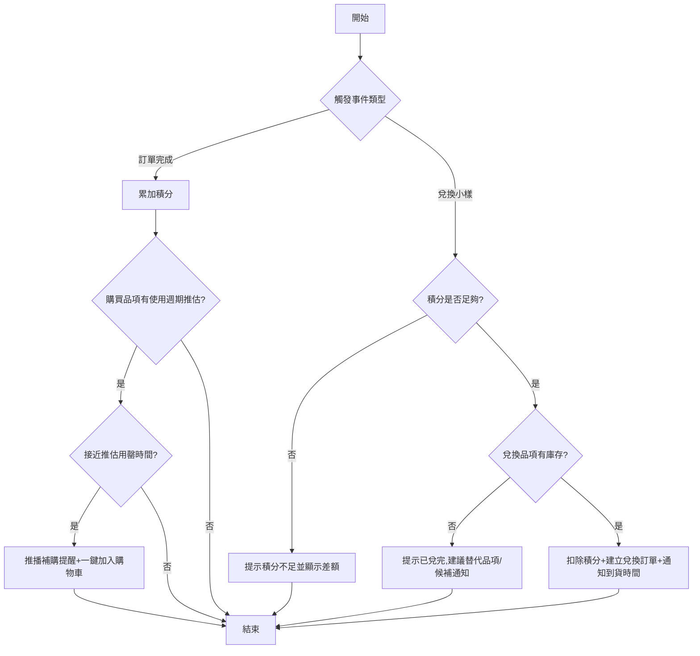

# User Story: 彩妝會員積分兌換與補購時機推薦

**As a** 已註冊品牌會員帳號的消費者
**I want to** 透過消費累積積分兌換小樣,並在適當時機收到補購提醒
**So that** 我能感受到消費被回饋,也不會因忘記補貨而中斷使用習慣 ⚠️〔信心:中〕- 「提升複購率」為推測性 KPI,建議與業務方確認實際目標

## 驗收標準 (Acceptance Criteria)

### 正常流程

- **Given** 會員已完成一筆訂單付款
  **When** 系統結算訂單
  **Then** 依訂單金額換算對應積分並即時累加至會員帳戶,同時顯示本次獲得積分明細

- **Given** 會員積分餘額足以兌換所選小樣
  **When** 會員於兌換頁面選擇欲兌換的小樣品項並確認
  **Then** 系統扣除對應積分並建立兌換訂單,通知會員預計到貨時間

- **Given** 會員過去購買過的商品有推估使用週期(如粉底液約 60 天用罄)⚠️〔信心:低〕- 使用週期為推測業務規則,需業務方依實際數據確認
  **When** 系統偵測到會員上次購買日期已接近推估用罄時間
  **Then** 系統推播補購提醒通知,並附上一鍵加入購物車的連結

### 異常流程

- **Given** 會員積分不足以兌換所選小樣
  **When** 會員嘗試兌換
  **Then** 系統提示積分不足,顯示所需積分差額,並提供額外獲取積分的途徑(如任務、邀請好友)

- **Given** 欲兌換的小樣品項已無庫存
  **When** 會員確認兌換
  **Then** 系統提示品項已兌完,並建議替代品項或提供候補通知選項

## 邊界情境 (Edge Cases)

1. 積分是否設有效期限,以及到期前的提醒機制(避免積分過期未使用引發客訴)
2. 會員等級變動(如降級)是否影響已累積積分或既有兌換權益
3. 補購時機推算未考慮實際用量差異(如用量偏大/偏小的用戶),可能導致提醒不準確,需與資料團隊驗證推估模型 ⚠️〔信心:低〕
4. 是否需要允許會員手動調整「預計用罄天數」以提升提醒準確度 ⚠️〔信心:低〕- 屬產品互動設計問題

## 流程圖

## ✏️ 待專業補充

請團隊補充以下資訊:
- [ ] **技術約束**:積分計算與兌換庫存的即時性要求、補購提醒推播的觸發頻率上限(避免打擾用戶)
- [ ] **優先順序確認**:補購時機推薦演算法是否有現成數據基礎,或需先累積購買行為數據
- [ ] **真實用戶驗證**:會員對「系統推算補購時機」準確度的實際感受與信任度
- [ ] **安全性考量**:積分與兌換紀錄涉及消費行為資料,需確認存取權限與合規要求
