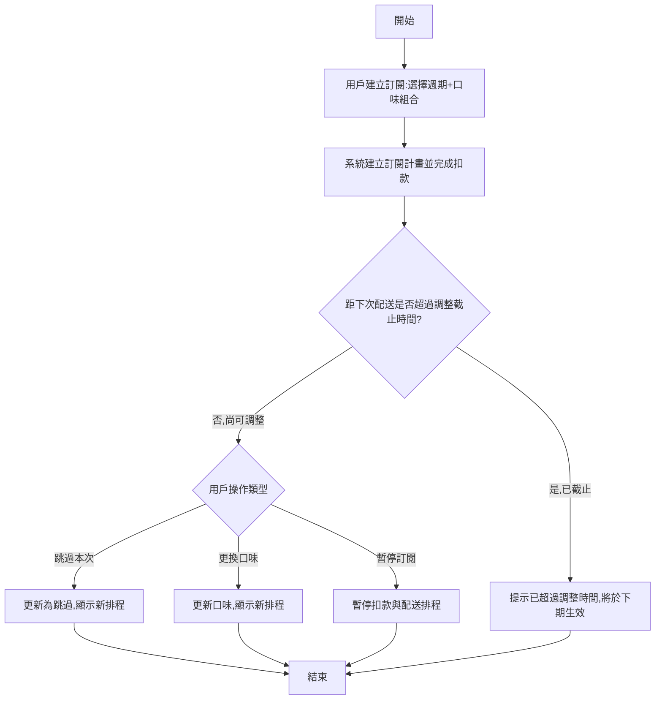

# User Story: 酸奶訂閱週期與口味彈性管理

**As a** 訂閱酸奶配送服務的消費者
**I want to** 自訂配送週期與口味組合,並能隨時暫停訂閱、跳過單次配送或更換口味
**So that** 我能依照自己的生活節奏與口味偏好靈活調整,不必因固定排程造成浪費或不滿意而取消訂閱 ⚠️〔信心:中〕- 此價值陳述為推測,建議與業務方確認實際目標(如降低取消率 vs 提升客單價)

## 驗收標準 (Acceptance Criteria)

### 正常流程

- **Given** 用戶已選擇訂閱方案(週期:每週/雙週/每月,口味組合可多選)
  **When** 用戶完成訂閱設定並付款
  **Then** 系統建立訂閱計畫,並顯示下次配送日期與口味明細

- **Given** 用戶的訂閱狀態為「進行中」,且距下次配送截止時間(假設為配送前 48 小時)⚠️〔信心:低〕- 截止時間點為假設,需與物流團隊確認實際前置作業時間,尚有餘裕
  **When** 用戶選擇「跳過本次配送」或「更換本次口味」
  **Then** 系統成功更新本次配送安排,並顯示更新後的配送明細

- **Given** 用戶想暫停訂閱
  **When** 用戶於訂閱管理頁選擇「暫停訂閱」並確認暫停期間
  **Then** 系統暫停後續扣款與配送排程,並於暫停期滿前提醒用戶是否恢復

### 異常流程

- **Given** 用戶欲跳過或更換口味的操作時間已超過配送截止時間
  **When** 用戶嘗試操作
  **Then** 系統提示「已超過本次調整時間,調整將於下一配送週期生效」

- **Given** 訂閱扣款失敗(如信用卡過期或餘額不足)
  **When** 系統嘗試執行週期扣款
  **Then** 系統暫停本次配送,通知用戶更新付款方式,並提供補款連結

## 邊界情境 (Edge Cases)

1. 用戶選擇的口味組合中有品項缺貨或已下架
2. 用戶同時擁有多個訂閱計畫(如不同口味、不同週期並存)時,管理介面與各自截止時間的衝突處理
3. 長期暫停(如超過 3 個月未恢復)是否應自動轉為取消訂閱,需業務規則確認 ⚠️〔信心:低〕
4. 首次訂閱是否提供試用價或首月優惠,將影響後續扣款金額的計算邏輯 ⚠️〔信心:低〕- 需與行銷團隊確認促銷規則

## 流程圖

## ✏️ 待專業補充

請團隊補充以下資訊:
- [ ] **技術約束**:配送截止時間與物流排程系統的實際串接規則、扣款失敗重試機制設計
- [ ] **優先順序確認**:暫停/跳過/更換口味三項彈性功能是否需分階段上線
- [ ] **真實用戶驗證**:用戶實際期望的調整彈性(如可否無限次跳過)與對應的成本影響
- [ ] **安全性考量**:定期扣款涉及金流資料,需確認符合支付安全規範(如 PCI DSS)
