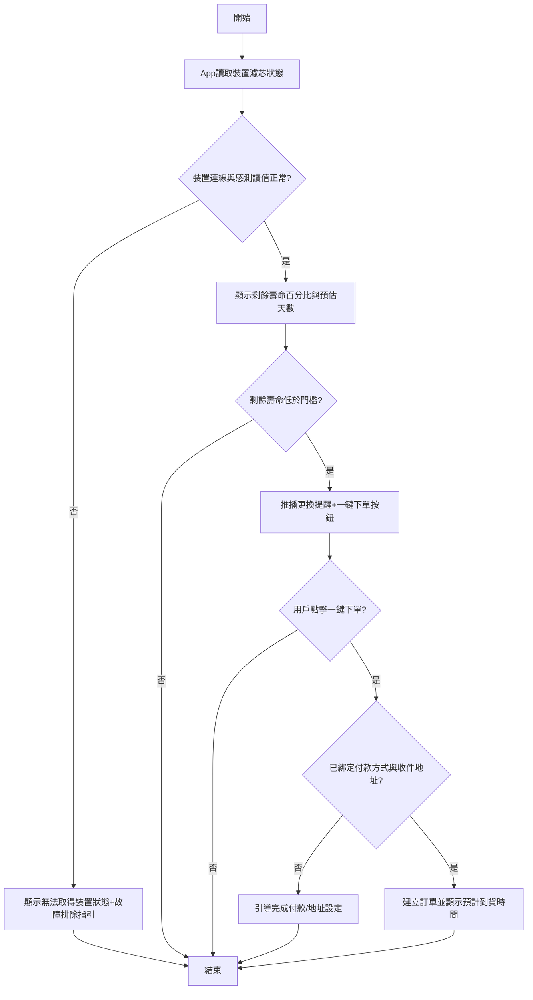

# User Story: 冰箱除味機濾芯壽命提醒與一鍵下單耗材

**As a** 使用冰箱除味機的家庭用戶
**I want to** 在 App 中查看濾芯剩餘壽命,並在需更換時收到推播提醒、一鍵下單耗材
**So that** 我不會因忘記更換濾芯導致除味效果下降,也能簡化耗材補貨流程 ⚠️〔信心:中〕- 此價值陳述為推測,建議與業務方確認是否以「耗材複購率」為主要目標

## 驗收標準 (Acceptance Criteria)

### 正常流程

- **Given** 除味機已連接 App 且濾芯使用中
  **When** 用戶開啟 App 查看設備狀態
  **Then** App 顯示濾芯剩餘壽命百分比與預估剩餘天數(依使用天數或感測器數值估算)⚠️〔信心:低〕- 具體量測方式為推測,需與硬體團隊確認

- **Given** 濾芯剩餘壽命低於預設門檻(假設為 20%)⚠️〔信心:低〕- 門檻數值為假設,需與硬體/演算法團隊確認合理值
  **When** 系統偵測到門檻觸發
  **Then** App 推播提醒用戶「濾芯即將到期,建議更換」,並附上一鍵下單耗材按鈕

- **Given** 用戶點擊一鍵下單耗材,且 App 已綁定收付款方式與收件地址 ⚠️〔信心:低〕- 是否已預先綁定為假設,需確認 App 既有帳戶設計
  **When** 用戶確認下單
  **Then** 系統建立訂單並顯示預計到貨時間,同時可選擇加入定期回購排程

### 異常流程

- **Given** 用戶點擊一鍵下單,但尚未綁定收付款方式或收件地址
  **When** 系統嘗試建立訂單
  **Then** 系統提示用戶先完成付款/地址設定,並引導至設定頁面

- **Given** 裝置與 App 斷線,或感測器讀值異常
  **When** App 嘗試讀取濾芯壽命狀態
  **Then** App 顯示「無法取得裝置狀態,請檢查裝置連線」,並提供故障排除指引連結

## 邊界情境 (Edge Cases)

1. 用戶同時擁有多台除味機裝置時,App 如何分別顯示各裝置的濾芯狀態與提醒
2. 濾芯壽命估算基於使用天數 vs 實際使用強度(如異味源濃度、使用頻率)可能存在落差
3. 是否需要允許用戶手動標記「已更換濾芯」以重置壽命計算,若用戶忘記標記可能導致系統持續誤判 ⚠️〔信心:低〕
4. 一鍵下單耗材是否僅鎖定原廠耗材,或支援替代品牌/規格選擇 ⚠️〔信心:低〕- 需與供應鏈/商品團隊確認

## 流程圖

## ✏️ 待專業補充

請團隊補充以下資訊:
- [ ] **技術約束**:濾芯壽命的實際量測方式(感測器 vs 使用天數估算)、裝置與 App 的連線穩定性要求
- [ ] **優先順序確認**:一鍵下單與定期回購排程是否需分階段上線
- [ ] **真實用戶驗證**:用戶對「壽命提醒門檻」與「一鍵下單」流程的實際接受度與信任度
- [ ] **安全性考量**:自動下單涉及金流與地址資料,需確認授權機制(如是否每次都需二次確認)以避免誤觸下單
