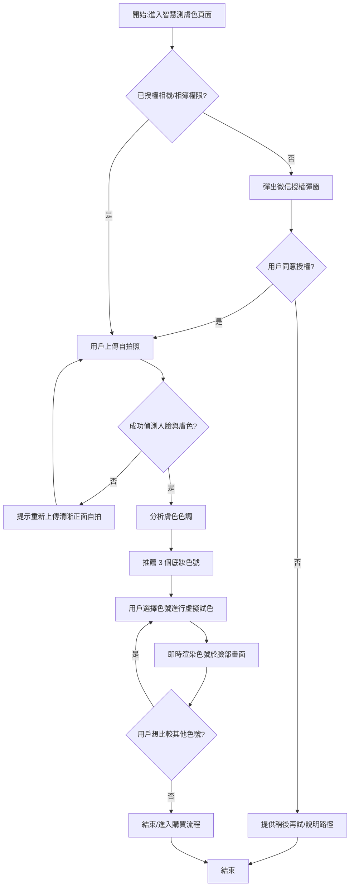

# User Story: 微信小程序智慧測膚色與虛擬試色

**As a** 想要選購底妝但不確定適合色號的微信小程序用戶
**I want to** 上傳自拍照讓系統辨識我的膚色,並取得推薦色號與虛擬試色預覽
**So that** 我不用到實體門市就能找到適合自己的底妝色號,更有信心地完成線上購買 ⚠️〔信心:中〕- 此價值陳述為推測,建議與業務方確認實際商業目標(例如是否以提升轉換率、降低退換貨率為主要 KPI)

## 驗收標準 (Acceptance Criteria)

### 正常流程

- **Given** 用戶已進入小程序的「智慧測膚色」頁面,且已授權相機或相簿存取權限
  **When** 用戶上傳一張正面、光線充足的自拍照
  **Then** 系統於 3 秒內完成人臉與膚色偵測,並顯示分析結果(如膚色色調、冷暖調)

- **Given** 系統已完成膚色分析
  **When** 分析流程結束
  **Then** 系統推薦 3 個最匹配的底妝色號,並顯示色號名稱、色卡色塊與匹配度百分比

- **Given** 用戶已取得 3 個推薦色號
  **When** 用戶點選其中一個色號進行虛擬試色
  **Then** 系統即時將該色號渲染疊加於用戶臉部畫面上(相機即時預覽或已上傳照片),並允許用戶切換比較另外兩個推薦色號

### 異常流程

- **Given** 用戶上傳的照片模糊、逆光或未偵測到人臉
  **When** 系統嘗試進行膚色分析
  **Then** 系統提示「無法辨識人臉,請重新上傳清晰的正面自拍照」,並引導用戶重新拍攝或上傳

- **Given** 用戶尚未授權相機或相簿權限
  **When** 用戶點擊「上傳自拍」
  **Then** 系統彈出微信授權彈窗,說明權限用途,並在用戶拒絕後提供「稍後再試」與「查看說明」的替代路徑

## 邊界情境 (Edge Cases)

1. 照片中包含多張人臉(如合照)時,系統需明確定義以哪張臉作為分析對象(例如畫面中最大或最居中的臉)
2. 環境光線過暗、過曝或偏色(如黃光燈)導致膚色偵測結果失真
3. 用戶自拍已上妝或套用美顏濾鏡,可能影響膚色偵測準確度,建議提示用戶盡量以素顏、自然光拍攝 ⚠️〔信心:低〕- 是否需要強制檢測濾鏡使用需與演算法團隊確認
4. 用戶膚色介於兩個色號的臨界值,系統如何決定優先推薦哪一色號、是否提供「兩色混合」建議 ⚠️〔信心:低〕- 屬於演算法策略問題,需與色彩/研發團隊確認
5. 網路不穩定或設備效能不足,導致虛擬試色即時渲染延遲、卡頓或失敗
6. 目標色號在庫存/供應鏈中缺貨或已下架,推薦結果是否仍應顯示、如何提示用戶 ⚠️〔信心:低〕- 需與商品/供應鏈團隊確認串接邏輯

## 流程圖

## ✏️ 待專業補充

請團隊補充以下資訊:
- [ ] **技術約束**:人臉偵測與膚色分析的效能要求(如 3 秒是否可行)、AR 即時渲染在微信小程序的效能與相容性限制(機型/微信版本)
- [ ] **優先順序確認**:此功能是否列入近期 Roadmap,以及與現有電商/導購功能的串接優先度
- [ ] **真實用戶驗證**:實際用戶對「上傳自拍」的接受度與隱私顧慮,是否需要提供「僅本地分析、不上傳伺服器」等選項
- [ ] **安全性考量**:自拍照片與生物特徵資料(膚色分析結果)的儲存期限、加密方式,是否需符合個資保護相關法規(如中國《個人信息保護法》)
