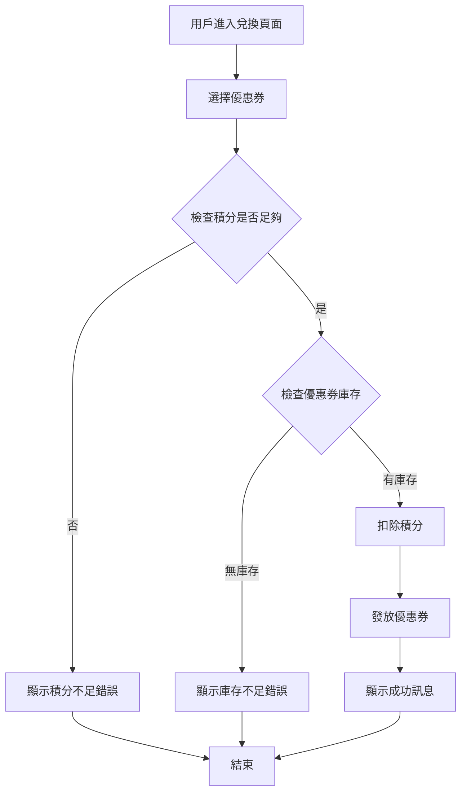

# User Story: 會員積分兌換優惠券

**As a** 註冊會員
**I want to** 使用積分兌換優惠券
**So that** 我可以在下次購物時享受折扣優惠

## 驗收標準 (Acceptance Criteria)

### 正常流程
- **Given** 我是已登入的會員,且帳戶有 500 積分
  **When** 我選擇兌換一張需要 300 積分的優惠券
  **Then** 系統扣除 300 積分,發放優惠券到「我的優惠券」,並顯示成功提示

- **Given** 我在「優惠券兌換頁面」
  **When** 我查看可兌換的優惠券清單
  **Then** 系統顯示所有可用優惠券,包含所需積分、有效期限、使用條件

- **Given** 我剛完成兌換
  **When** 我進入「我的優惠券」頁面
  **Then** 系統顯示剛兌換的優惠券,包含優惠碼、有效期限、使用規則

### 異常流程
- **Given** 我的帳戶只有 200 積分
  **When** 我嘗試兌換需要 300 積分的優惠券
  **Then** 系統顯示錯誤訊息「積分不足,無法兌換」,並保持積分餘額不變

- **Given** 某張優惠券庫存為 0
  **When** 我嘗試兌換該優惠券
  **Then** 系統顯示「該優惠券已兌換完畢」,並將該券標記為不可兌換

- **Given** 網路連線中斷
  **When** 我點擊「確認兌換」按鈕
  **Then** 系統顯示「網路錯誤,請稍後再試」,不扣除積分

## 邊界情境 (Edge Cases)

1. **重複提交**:用戶在兌換過程中多次點擊確認按鈕,系統應防止重複扣點 ⚠️ 〔信心:中〕- 建議與後端團隊確認冪等性設計
2. **優惠券數量競爭**:多人同時兌換最後一張優惠券時的庫存鎖定機制 ⚠️ 〔信心:低〕- 需確認是否採用樂觀鎖或悲觀鎖
3. **積分過期**:如果用戶的積分包含即將過期的部分,應優先扣除即將過期的積分 ⚠️ 〔信心:低〕- 需業務方確認積分使用規則
4. **兌換後取消**:用戶是否可以取消兌換並退回積分? ⚠️ 〔信心:低〕- 需產品經理定義退換政策

## 流程圖

## ✏️ 待專業補充

請團隊補充以下資訊:
- [ ] **技術約束**:
  - 積分扣除與優惠券發放是否需要資料庫事務(transaction)?
  - 優惠券庫存的併發控制策略?
  - API 回應時間要求(如:<500ms)?
- [ ] **優先順序確認**:
  - 此功能是否為本季 OKR 關鍵結果?
  - 是否需要在「雙 11 活動」前上線?
- [ ] **真實用戶驗證**:
  - 是否已有用戶研究支持「積分兌換」比「積分折抵」更受歡迎?
  - 用戶是否期望收到兌換成功的推播通知?
- [ ] **安全性考量**:
  - 是否需要防止腳本自動化兌換(加入驗證碼)?
  - 優惠券是否需要防偽機制(如:唯一優惠碼)?
